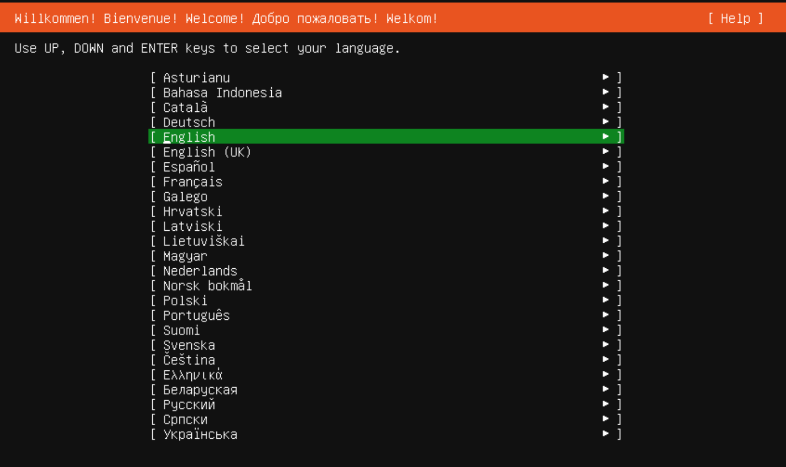
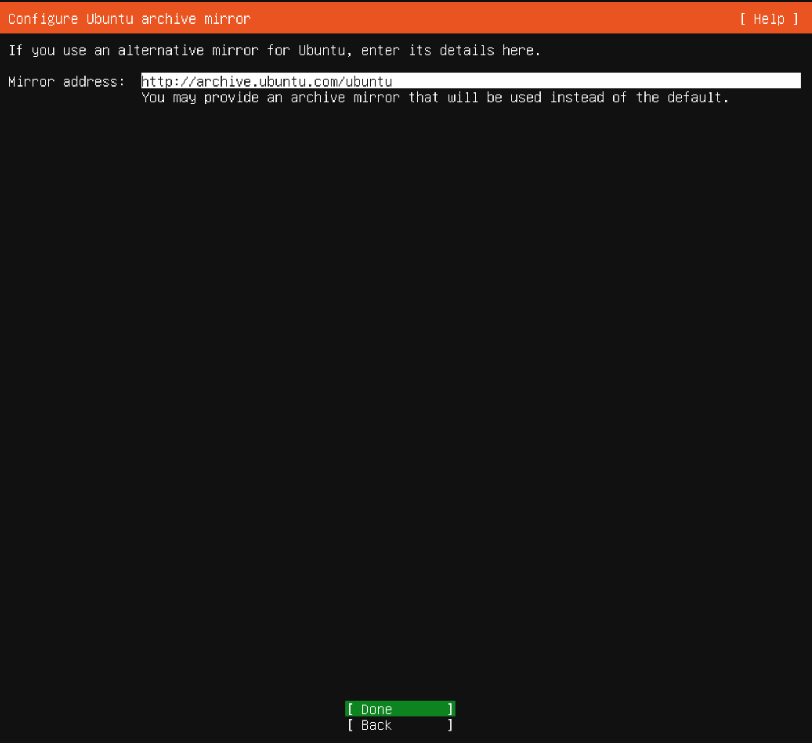
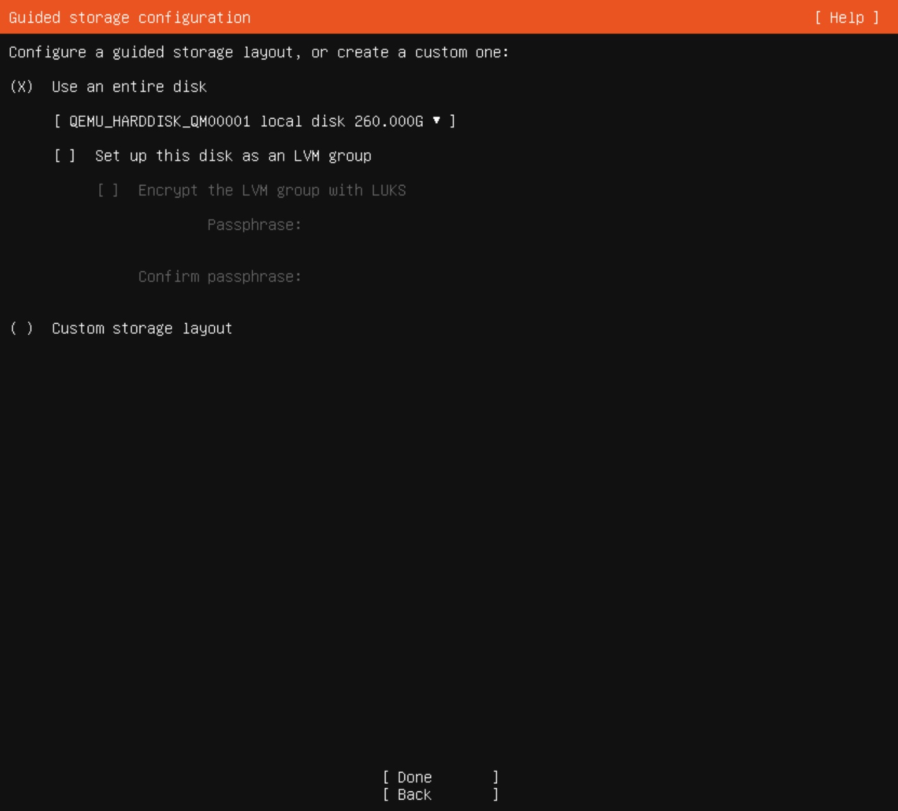

# Installation Guide with Pre-packaged ISO

This document describes how to use a pre-packaged image to install the operating system and related components of open-hydra.

## Download Image

* [baidu disk](https://pan.baidu.com/s/1GsHhDEnRMBBUrQXpusmtSA?pwd=uc2e) code: uc2e

## Minimum Hardware Requirements

* CPU core >= 8
* 250 GB 硬盘 >= 1
* memory >= 32 GB
* (optional)nvidia gpu >= 1 (driver: 525.125.06)

## Components included in the USB

* ubuntu-server-20.04.6-live-server-amd64.iso
  * k8s aio cluster deploy with [kubeclipper](https://github.com/kubeclipper/kubeclipper)
  * open-hydra
    * server
    * reverse proxy for api-server(Not recommended in a secure environment)
    * dashboard(not recommended in a secure environment)
  * gpu-operator
    * nvidia-driver
    * nvidia-container-toolkit
    * nvidia-dcgm-exporter
    * nvidia-device-plugin
    * nvidia-cuda-validator

## Installation Process Introduction

1. Insert the USB into the host
2. Restart the host
3. Enter the boot menu (the method varies depending on the motherboard, such as F12, F8, or F11)
4. Select USB boot
5. Start the installation process
6. After the installation is complete, restart the host
7. Remove the USB from server
8. Enter the system
9. Wait for completion of openhydra installation

## Installation Process Detailed Description

### Step 1--Start the installation process

* After entering the USB boot interface, there will be a period of time for the ISO data verification process, which will last for about 3-5 minutes, as shown below


* Language selection--In the pop-up language learning interface, we choose "English" and press the Enter key, as shown below



* Language selection--In the next pop-up dialog box, press Enter to confirm, as shown below


* network configuration--In the pop-up network configuration interface, we press the "up arrow" key to select the first network card that is selected by default, as shown below


* network configuration--After pressing the Enter key, in the pop-up network configuration interface, select "Edit IPv4" and press Enter, as shown below


* network configuration--In the pop-up network configuration interface, we select "Manual" and press Enter, as shown below
* modify the address that suits your network environment, here we set it to
* ensure this network adapter is connected to the network or k8s will fail to install


* network configuration--In the pop-up address input box, enter the address. Here, for the convenience of later network configuration, we set it to


* network configuration--After waiting for 10 seconds, the "Done" option will appear at the bottom. We press the "down arrow" key to select "Done" and press Enter, as shown below


* proxy configuration--skip directly press Enter, as shown below


* mirror configuration--skip directly press Enter, as shown below



* upgrade page--because of no external internet, it will skip automatically after a period of time
* storage configuration--We move the cursor up to "Set up this disk as an LVM group" and press the "space" key, as shown below


* storage configuration--Deselect "Set up this disk as an LVM group", as shown below



* storage configuration--Move the cursor to "Done" at the bottom and press Enter, as shown below


* storage configuration--Click "Done" again in the pop-up interface. Don't worry about the disk size, because the machine in the screenshot may not be the same as your final disk size, as shown below


* storage configuration--In the pop-up interface, move the cursor to "Continue" and press Enter to confirm, as shown below


* user configuration--In the pop-up interface, for the sake of convenience, we enter "test" for all, then move the cursor to "Done" and press Enter, as shown below


* ssh configuration--The cursor defaults to "Install OpenSSH server" in the pop-up whether to install ssh, as shown below


* ssh configuration--We directly press the "space" key, move the cursor to select "Done" below, and press Enter to confirm, as shown below


* Wait for installation to complete, as shown below


* Wait for the "Reboot Now" option to appear, move the cursor to "Reboot now"
* Remove the USB and install it normally to enter the system


## View installation output logs

```bash
$ journalctl -u maas -f

# output
# You should see maas.service: Succeeded if the installation is successful
-- Logs begin at Sun 2023-12-10 10:58:29 UTC. --
...
Dec 10 11:29:14 test systemd[1]: maas.service: Succeeded.
Dec 10 11:29:14 test systemd[1]: Finished maas service.

# Check the status of the pod
$ kubectl get pod -A

# Output, ignore the AGE column, because the picture is pre-cut
NAMESPACE            NAME                                                          READY   STATUS             RESTARTS       AGE
default              gpu-pod                                                       0/1     Completed          0              5d4h
gpu-operator         gpu-feature-discovery-w5nkp                                   1/1     Running            0              5d5h
gpu-operator         gpu-operator-67f8b59c9b-94qc8                                 1/1     Running            1 (3d7h ago)   5d5h
gpu-operator         nfd-node-feature-discovery-gc-5644575d55-dlfvj                1/1     Running            0              5d5h
gpu-operator         nfd-node-feature-discovery-master-5bd568cf5c-dj4qj            1/1     Running            0              5d5h
gpu-operator         nfd-node-feature-discovery-worker-vz7jb                       1/1     Running            3 (3d7h ago)   5d5h
gpu-operator         nvidia-container-toolkit-daemonset-q97hp                      1/1     Running            0              5d5h
gpu-operator         nvidia-cuda-validator-xk4dm                                   0/1     Completed          0              5d5h
gpu-operator         nvidia-dcgm-exporter-b2kl6                                    1/1     Running            0              5d5h
gpu-operator         nvidia-device-plugin-daemonset-mxtz7                          1/1     Running            0              5d5h
gpu-operator         nvidia-driver-daemonset-5.15.0-91-generic-ubuntu22.04-4g5sj   1/1     Running            0              5d5h
gpu-operator         nvidia-operator-validator-5kgs8                               1/1     Running            0              5d5h
kube-system          calico-kube-controllers-6c557bcb96-dx6kl                      1/1     Running            0              5d5h
kube-system          calico-node-skkbx                                             1/1     Running            0              5d5h
kube-system          coredns-bd6b6df9f-bgf6x                                       1/1     Running            0              5d5h
kube-system          coredns-bd6b6df9f-qmxh5                                       1/1     Running            0              5d5h
kube-system          dashboard-cluster-metrics-scraper-7d84b7bd69-fz4fl            1/1     Running            0              5d4h
kube-system          dashboard-user1-metrics-scraper-b45b9c7b5-crtzw               1/1     Running            0              5d4h
kube-system          etcd-test                                                     1/1     Running            0              5d5h
kube-system          kc-csi-controller-96579d646-vjwnw                             9/9     Running            8 (3d7h ago)   5d5h
kube-system          kc-csi-node-plugin-sflfb                                      6/6     Running            0              5d5h
kube-system          kc-csi-reloader-f44f86d76-dhj8c                               1/1     Running            0              5d5h
kube-system          kc-kubectl-7f854bbd9b-6lzn7                                   1/1     Running            0              5d5h
kube-system          kube-apiserver-test                                           1/1     Running            0              3d7h
kube-system          kube-controller-manager-test                                  1/1     Running            1 (3d7h ago)   5d5h
kube-system          kube-proxy-n5f7g                                              1/1     Running            0              5d5h
kube-system          kube-scheduler-test                                           1/1     Running            1 (3d7h ago)   5d5h
kube-system          kubeflow-prometheus-adapter-8f5cc9479-vwq9l                   1/1     Running            0              5d4h
kube-system          kubernetes-dashboard-cluster-8c65bdb47-j95pv                  1/1     Running            1 (5d4h ago)   5d4h
kube-system          kubernetes-dashboard-user1-97865494c-tdbfp                    1/1     Running            0              5d4h
kubeflow             minio-7f4cc98d67-q8tsk                                        1/1     Running            0              5d4h
kubeflow             training-operator-5545844cb8-t4mjj                            1/1     Running            0              5d4h
kubeflow             volcano-controllers-5fdc7dd79d-s5bkh                          1/1     Running            0              5d4h
kubeflow             volcano-scheduler-8695f4fc84-m4b7c                            1/1     Running            0              5d4h
kubeflow             workflow-controller-558df5fd-qtfxg                            1/1     Running            3 (3d7h ago)   5d4h
local-path-storage   local-path-provisioner-58b65c8d5d-784lq                       1/1     Running            0              3d1h
monitoring           grafana-7c754b9cc5-7whb2                                      1/1     Running            0              5d4h
monitoring           node-exporter-cwdnz                                           2/2     Running            0              5d4h
monitoring           prometheus-k8s-0                                              2/2     Running            1 (5d4h ago)   5d4h
monitoring           prometheus-operator-7688cdc9bd-x7thd                          1/1     Running            0              5d4h
mysql-operator       mycluster-0                                                   2/2     Running            0              3d1h
mysql-operator       mycluster-router-5d74f97d5b-plpp5                             1/1     Running            0              3d1h
mysql-operator       mysql-operator-66bfb7f6df-82zcn                               1/1     Running            0              3d1h
open-hydra           open-hydra-server-5c659bf678-n5ldl                            1/1     Running            0              3d1h
open-hydra           open-hydra-ui-79c444fc4c-w59ws                                1/1     Running            0              3d1h
open-hydra           reverse-proxy-6b4d55d79-77s65                                 1/1     Running            0              3d1h
```

## Access the dashboard

* Open browser and enter the address `http://[ip]:30001`
  * login with admin/openhydra

## Screen freezed issue

* Some servers with gpu may have screen freezed issue during installation, this is due to the gpu driver installation during the installation process, you can restart the server to fix it or switch video output from gpu to other output device, or you can ssh into the server to manage it without restart

## diable auto upgrade

Due to gpu operator is build on linux kernel, we use offline driver image `-generic` to install gpu driver offline that's why gpu operator will failed to work every time linux kernel gets upgraded, so we need to disable auto upgrade unless you intend to upgrade.

```bash
# disable kernel upgrade
$ apt-mark hold linux-headers-generic
$ apt-mark hold linux-image-generic
```