# OpenHydra用户手册

## 平台概述
OpenHydra 是一款由管理端、学生端组成的综合人工智能教育实验管理平台，以Web UI的方式为学生提供即开即用，即关即停，轻量可靠的AI实验平台，学生和老师可以通过便捷的启用CPU或GPU实训环境来完成人工智能课程的实操练习。通过OpenHydra平台，教师和学生可以直接参考学习，并参与到人工智能相关的项目开发中，从而培养用AI解决真实问题的能力。

## 管理端
只有【教师角色】账号可以登陆管理端，教师账号可通过管理端进行管理账户、设备、数据集和课程资源。

### 用户管理
用户管理包括创建用户和删除用户等功能。

#### 查看账户列表
1. 用户登陆管理端，点击“账号管理”，进入账户管理页面；
2. 查看账号列表，账号列表信息包括：账号、姓名、角色、描述和“删除”操作，用户可设置列表中要展示的列；

#### 创建用户
1. 用户登陆管理端，点击“账号管理”，进入账号管理页面；
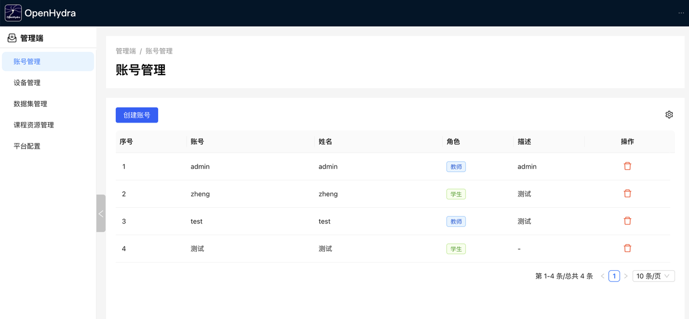
2. 点击“创建账号”按钮，在弹出的创建账号页面中输入以下内容：
    - 在‘账号’输入框中输入“账号”；
    - 在‘姓名’输入框中输入“姓名”；
    - 在‘密码’输入框中输入“密码”；
    - 在‘确认密码’输入框中输入“确认密码”，确认密码要和密码一致；
    - 在‘角色’下拉框中选择“角色”；
    - 在‘描述’输入框中输入“描述”，最大字符数不超过100个字符；
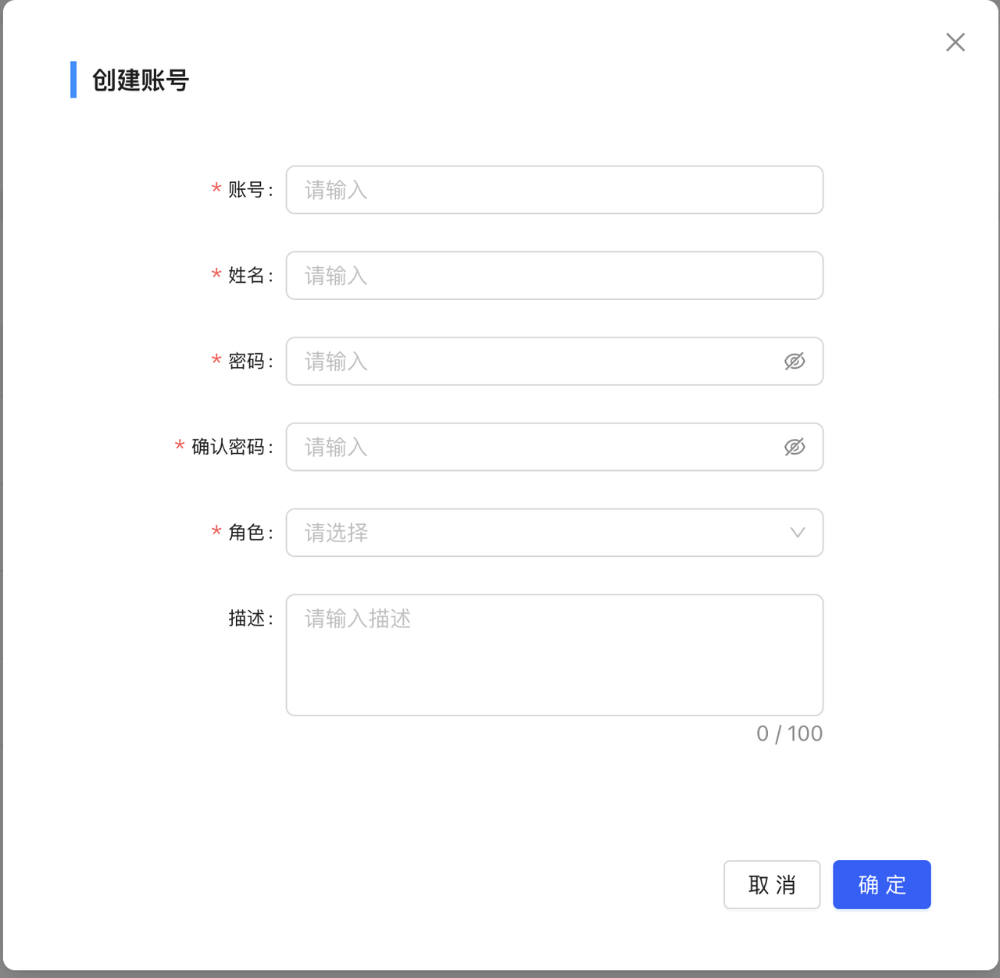
3. 点击“确认”按钮，成功创建账号并保存密码；
4. 点击"取消"按钮，取消创建账号并返回到账号管理页面中；

#### 删除用户
1. 用户登陆管理端，点击“账号管理”，进入账号管理页面；
2. 选择一个账号，点击其后的“删除”按钮，弹出提示确认框；
3. 点击“确定”按钮，成功删除账号；
4. 点击"取消"按钮，取消删除账号并返回到账号管理页面中；
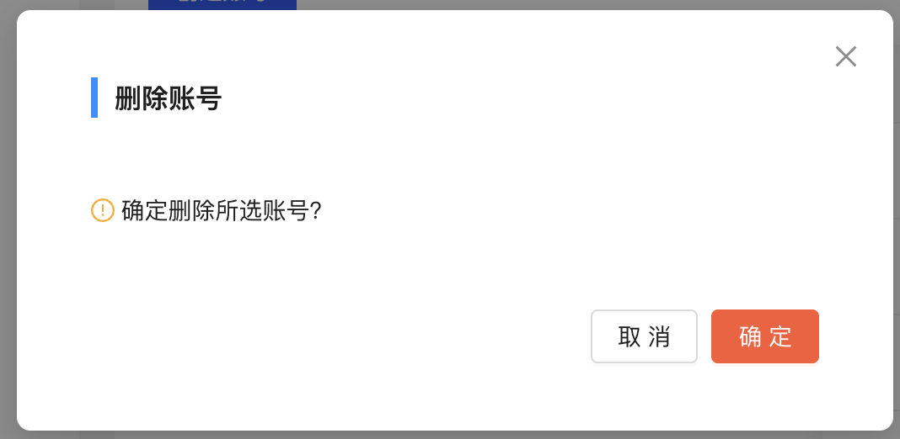

### 设备管理
设备管理包括设备启动和关闭设备等功能。

#### 查看设备管理列表
1. 用户登陆管理端，点击“设备管理”，进入设备管理页面；
2. 查看设备管理列表，设备管理列表信息包括：IP地址、账号、启动时间、角色、姓名、容器状态、容器类型、jupyterLabUr、vsCodeUrl和操作按钮“启动”“关闭”，用户可设置列表中要展示的列；

#### 启动设备
1. 用户登陆管理端，点击“设备管理”，进入设备管理页面；
2. 选择一个设备，点击其后的“启动”按钮，在弹出的创建账户页面中输入以下内容：
在‘启动容器’多选框中选择“CPU实验室”和“Jupyter Lab”；
  注：只能通过管理端启动GPU实验室，学生端启动的均为CPU实验室；
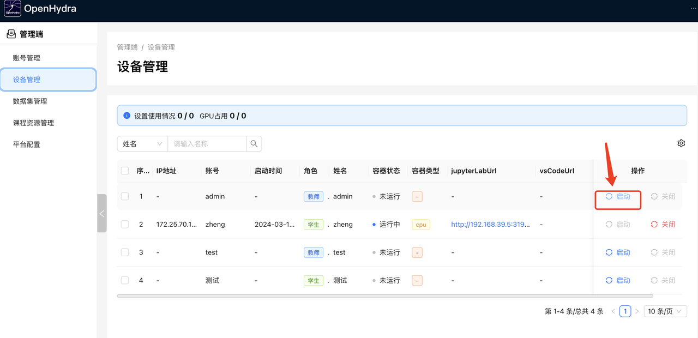

3. 点击“确认”按钮，成功启动设备；
注：
    + 管理端和学生端的实验室设备均启动；
    + 管理端可通过jupyterLabUr、vsCodeUrl进入操作；
    + 学生端实验室设备被启动，用户可进入；
1. 点击"取消"按钮，取消启动设备并返回到设备管理页面中；

#### 关闭设备
1. 用户登陆管理端，点击“设备管理”，进入设备管理页面；
2. 选择一个已启动的设备，点击其后的“关闭”按钮，弹出的提示确认框；
3. 点击“确认”按钮，成功关闭设备；
注：管理端和学生端的实验室设备均被关闭；
4. 点击"取消"按钮，取消关闭设备并返回到设备管理页面中；
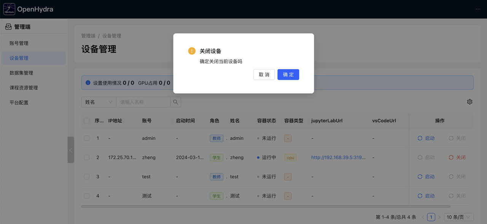

### 数据集管理
数据集管理包括数据集上传和删除用户等功能。

#### 查看数据集管理列表
1. 用户登陆管理端，点击“数据集管理”，进入数据集管理页面；
2. 查看数据集管理列表，数据集管理列表信息包括：数据集、描述和操作按钮“删除”，用户可设置列表中要展示的列；
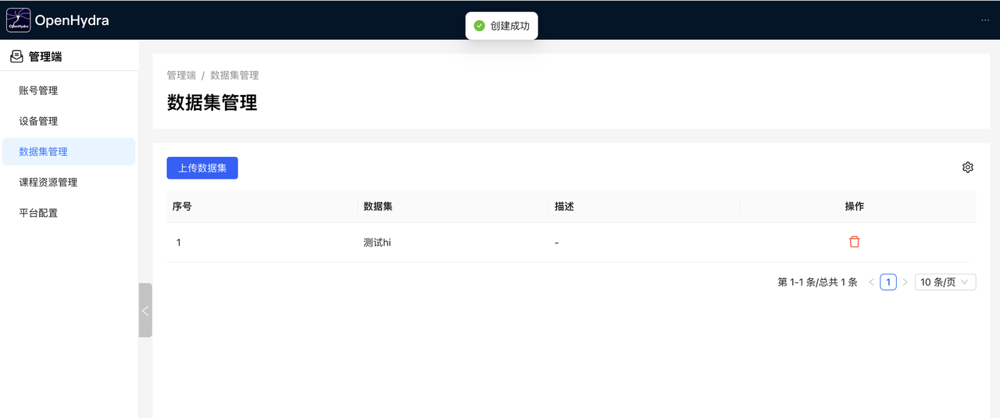

#### 上传数据集
1. 用户登陆管理端，点击“数据管理”，进入数据管理页面；
2. 点击“上传数据集”按钮，在弹出的上传数据集页面中输入以下内容：
    - 在‘数据集名称’输入框中输入“数据集名称”；
    - 在‘选择文件’上传框中选择“上传文件”，只允许选择zip类型文件上传；
    - 在‘描述’输入框中输入“描述”，最大字符数不超过100个字符；

3. 点击“确认”按钮，成功上传数据集；
4. 点击"取消"按钮，取消上传数据集并返回到数据集管理页面中；

#### 删除数据集
1. 用户登陆管理端，点击“数据集管理”，进入数据集管理页面；
2. 选择一个数据集，点击其后的“删除”按钮，弹出提示确认框；

3. 点击“确定”按钮，成功删除数据集；
4. 点击"取消"按钮，取消删除数据集并返回到数据集管理页面中；

### 课程资源管理
课程资源管理包括课程资源上传和删除课程资源等功能。

#### 查看课程资源管理列表
1. 用户登陆管理端，点击“课程资源管理”，进入课程资源管理页面；
2. 查看课程资源管理列表，课程资源管理列表信息包括：课程资源、描述和操作按钮“删除”，用户可设置列表中要展示的列；

#### 上传课程资源
1. 用户登陆管理端，点击“课程资源管理”，进入课程资源管理页面；
2. 点击“上传课程资源”按钮，在弹出的上传课程资源页面中输入以下内容：
    - 在‘课程资源名称’输入框中输入“课程资源名称”；
    - 在‘选择文件’上传框中选择“上传文件”，只允许选择zip类型文件上传；
    - 在‘描述’输入框中输入“描述”，最大字符数不超过100个字符；
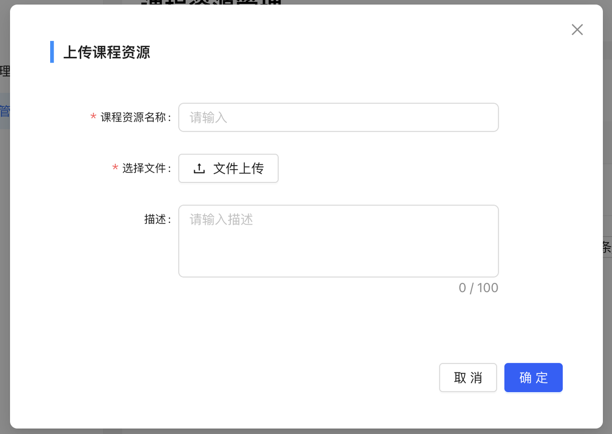
3. 点击“确认”按钮，成功上传课程资源；
4. 点击"取消"按钮，取消上传课程资源并返回到课程资源管理页面中；

#### 删除课程资源
1. 用户登陆管理端，点击“课程资源管理”，进入课程资源管理页面；
2. 选择一个课程资源，点击其后的“删除”按钮，弹出提示确认框；
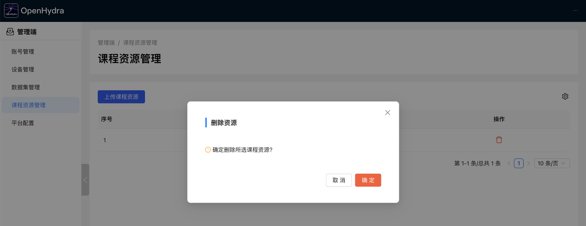
3. 点击“确定”按钮，成功删除课程资源；
4. 点击"取消"按钮，取消删除课程资源并返回到课程资源管理页面中；

### 平台配置
平台配置提供编辑配置功能。

#### 编辑平台配置
1. 用户登陆管理端，点击“平台配置”，进入平台配置页面；
2. 点击“编辑”按钮，在弹出的基本信息中输入以下内容：
    - 在‘设备类型’下拉框中选择“CPU”；

3. 点击“提交”按钮，成功编辑平台设置；
4. 点击"取消"按钮，取消编辑平台设置并返回到平台配置页面中；

## 学生端
学生端是为【学生角色】提供登录的平台，学生账户可以通过学生端进行学习和课程资源的使用。

### 实验环境
#### 开启实验环境
1. 用户登陆学生端，进入实验环境页面；
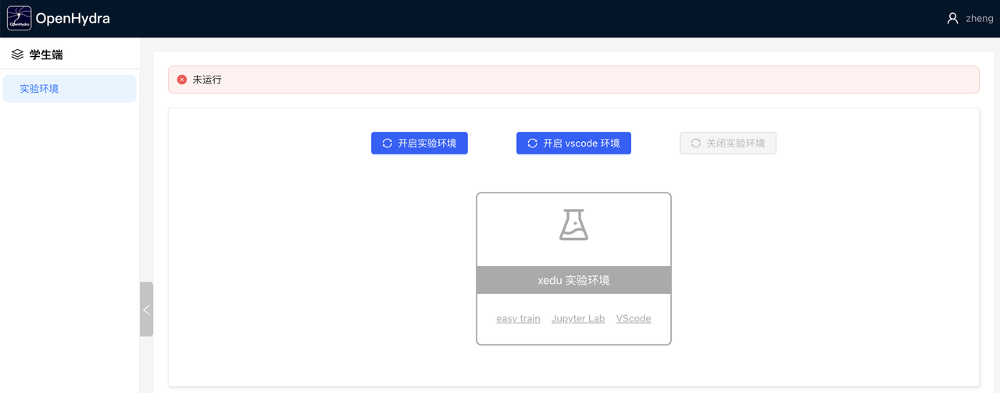
2. 点击“开启实验环境”按钮，xedu实验环境开启，easy train和Jupyter Lab可选择；
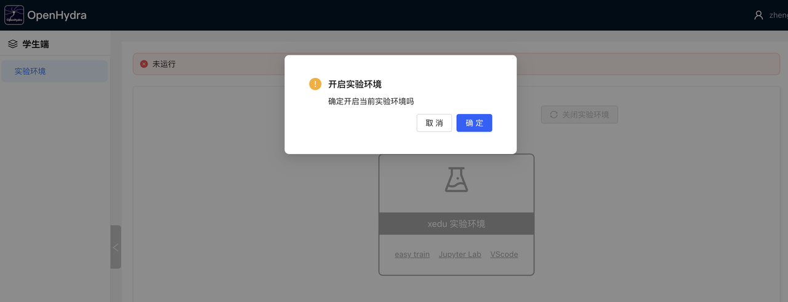
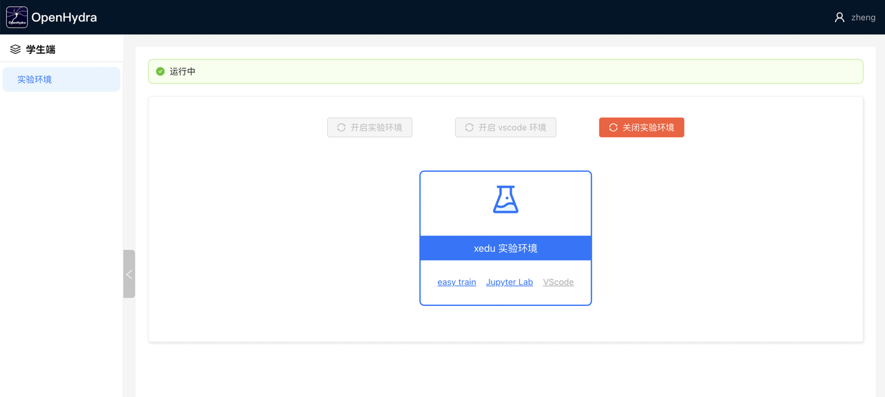

#### 开启vscode实验环境
1. 用户登陆学生端，进入实验环境页面；
2. 点击“开启vscode实验环境”按钮，xedu实验环境开启，仅VScode环境可选择；
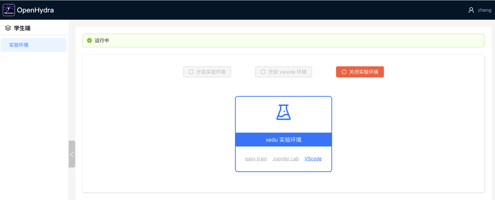

#### 体验easy train环境
前提：存在开启中的实验环境；
1. 用户登陆学生端，进入实验环境页面；
2. 点击“easy train”按钮，进入easy train页面；
3. 根据训练步骤进行操作训练；

#### 体验Jupyter Lab环境
1. 用户登陆学生端，进入实验环境页面；
2. 点击“Jupyter Lab”按钮，进入Jupyter Lab页面；
3. 查看文件夹，点击进入课程资源文件夹；

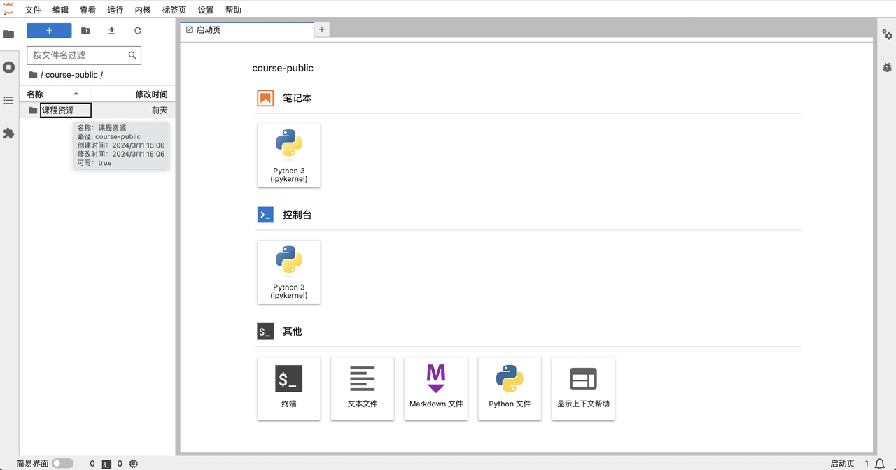
4. 打开课程资源文件，查看课程资源内容
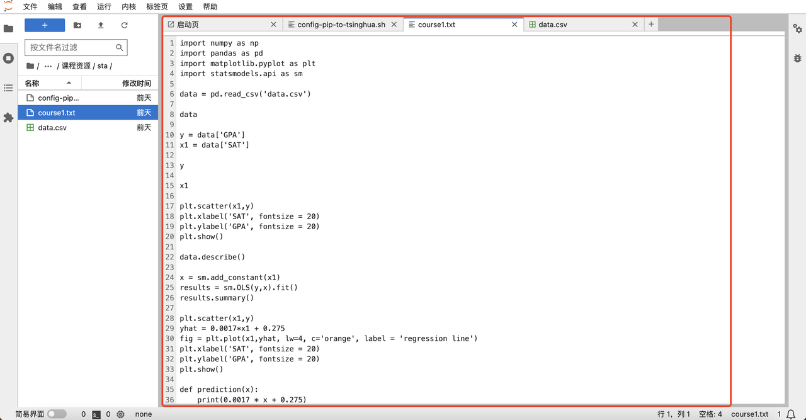
5. 点击创建新文件

6. 输入代码并执行
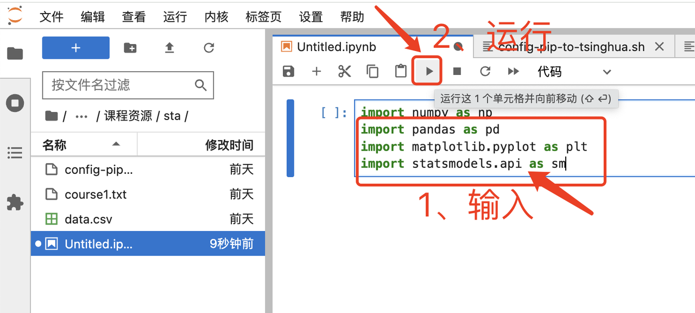
7. 执行完成，输出结果并保存文件
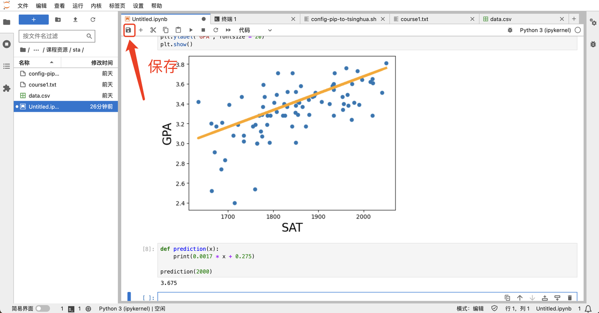

#### 体验VScode环境
1. 用户登陆学生端，进入实验环境页面；
2. 点击“vscode”按钮，进入vscode页面；
3. 点击“next section”跳过创建工程；
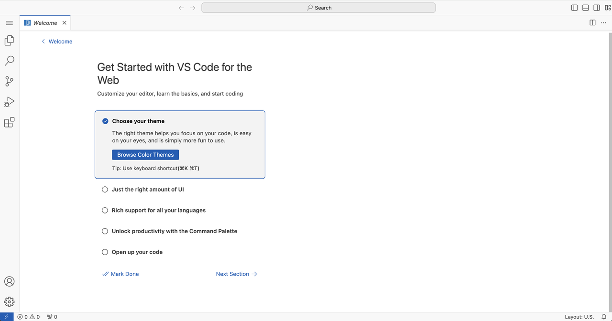
4. 点击“New File”按钮创建新文件或打开文件夹
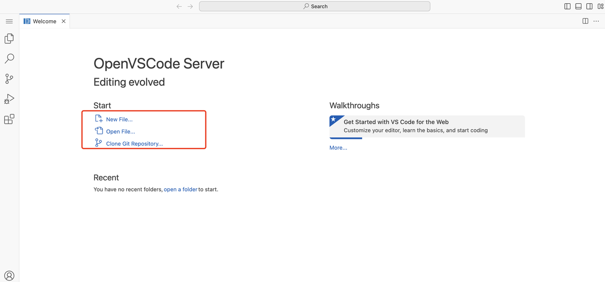

#### 关闭实验环境
前提：存在开启中的实验环境；
1. 用户登陆学生端，进入实验环境页面；
2. 点击“关闭实验环境”按钮，弹出提示确认框；
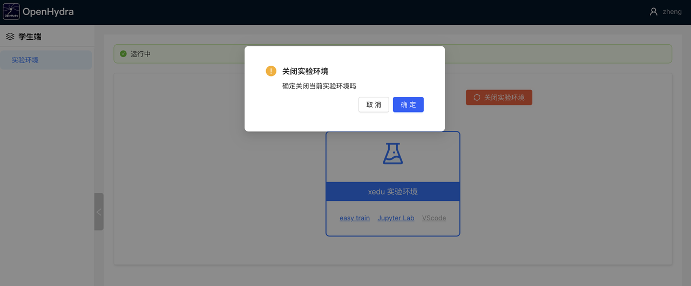
3. 点击“确定”按钮，成功关闭实验环境；
4. 点击"取消"按钮，取消关闭实验环境并返回到实验环境页面中；

